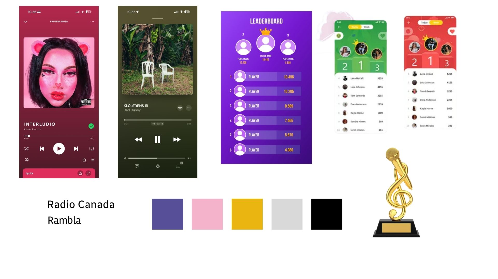

# Phrase choc

Et si découvrir de la musique devenait un jeu ?

#  Analyse des besoins
##  Public cible
1. Auditeurs curieux

- Utilisateurs qui veulent découvrir de la nouvelle musique

- Fans de playlists variées

- Utilisateurs qui aiment les apps basées sur la gamification

2. Artistes émergents

- Musiciens voulant augmenter leur visibilité

- Producers voulant tester des beats

- Artistes locaux (ex : Montréal/Laval)

3. Créateurs / Producers

- Personnes qui veulent promouvoir leurs extraits ou démos

- Artistes indépendants qui ont besoin d’un public réactif

##  Ce qui est important pour eux
Pour les auditeurs :

- Découvrir des artistes nouveaux et authentiques

- Avoir une application fun et motivante

- Recevoir des récompenses virtuelles ou réelles

- Appartenir à une communauté

- Un système qui ne dépend pas d’un gros algorithme

Pour les artistes :

- Gagner une vraie visibilité

- Toucher un public motivé

- Avoir des écoutes réelles

- Accéder à une plateforme moins compétitive que Spotify/TikTok

- Avoir des outils promotionnels simples

##  Problème ou opportunité

**Problème** :
Les auditeurs écoutent toujours les mêmes artistes, et les plateformes populaires ne mettent pas assez en avant les nouvelles musiques. Les artistes émergents n’arrivent pas à se faire découvrir.

**Opportunité** :
Créer une plateforme gamifiée où découvrir un artiste est récompensé, ce qui stimule la découverte et donne de la vraie visibilité aux artistes.

#  Présentation du concept
##  Éléments importants du concept (5+)

- Défis musicaux quotidiens

- Système de points, badges, achievements et leaderboard

- Récompenses réelles (codes rabais, accès exclusifs) offertes par artistes partenaires

- Fil de découverte musicale basé sur mood, genre ou artistes locaux

- Profil utilisateur personnalisable

- Espace Artiste pour promouvoir leurs chansons

- Hall of Fame pour montrer les achievements

##  Choix technologiques

- Application mobile (iOS & Android)

- Base de données Firebase ou AWS

- Backend : Node.js ou Python

- Interface UI/UX designée dans Figma

- Lecteur audio intégré

- Algorithme de recommandation basé sur préférences + interactions

- Système de gamification interne (points, streaks, etc.)

##  Comment le concept répond aux attentes du public-cible ?

- Il rend la découverte musicale simple et motivante

- Il crée un écosystème gagnant-gagnant :

- Les utilisateurs gagnent des récompenses

- Les artistes gagnent de la visibilité

- Il encourage un usage quotidien grâce aux défis

- Il met en avant les artistes émergents plutôt que les gros artistes

- Il crée un sentiment de progression et de communauté

#  Description des tâches principales
##  Phase 1 : Préproduction
Tâches essentielles :

- Analyse du marché

- Définition du concept complet

- Choix des fonctionnalités

- Création du moodboard

- Wireframes (maquettes basse fidélité)

- Choix des technologies

- Planification du développement

##  Phase 2 : Production
Tâches essentielles :

- Développement de l’interface utilisateur

- Développement du backend

- Intégration du lecteur audio

- Système de connexion/inscription

- Implémentation du système de points

- Création des badges, achievements et leaderboard

- Tests internes

## Phase 3 : Postproduction
Tâches essentielles :

- Ajustements UI/UX

- Correction des bugs

- Optimisation du code

- Tests utilisateurs

- Ajustements basés sur retours utilisateurs

##  Phase 4 : Opération
Tâches essentielles :

- Maintenance de l’application

- Ajout régulier de nouveaux défis

- Tests continus

- Gestion des partenariats artistes

- Analyse des statistiques

- Mises à jour et nouvelles fonctionnalités

#  Moodboard (Description visuelle)

##  Style global

- Couleurs: Vibrante et contrastée. Arrière-plan adaptatif basé sur les couleurs de la pochette de l'album.
  
- Ludique, vibrant et social
  
- Interface dynamique et intuitive

##  Éléments visuels

Vagues sonores

Écouteurs, vinyles, cartes musicales

Icônes minimalistes

Badges holographiques

Interface façon “feed” avec cartes d’artistes

#  Maquette / Scénarimage

#  Conclusion
##  Ce qui rend le projet innovant

Une plateforme qui mélange musique + gamification + récompenses

Encourage une découverte musicale active, pas passive

Met en avant les artistes émergents d’une manière unique

##  Ce qui le distingue de la concurrence

Spotify et TikTok ne récompensent pas la découverte

Aucun leaderboard ou système de défis dans les grandes plateformes

Application pensée spécifiquement pour les artistes émergents

Écosystème gagnant pour les utilisateurs et les artistes

##  Pourquoi il attirerait des investisseurs Kickstarter

Concept original et unique sur le marché

Modèle économique viable :

Publicités

Partenariats

Boosts premium

Coût de développement raisonnable

Potentiel viral énorme grâce aux défis quotidiens

Plateforme qui soutient l’industrie indépendante

